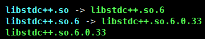

---
html:
    toc: true
    # number_sections: true # 标题开头加上编号
    toc_depth: 6
    toc_float:
        collapsed: false # 控制文档第一次打开时目录是否被折叠
        smooth_scroll: true # 控制页面滚动时，标题是否会随之变化
---

[toc]

---

## 前言

通常使用以下命令更新 conda，但是更新完还是提示conda需要更新：

```bash
conda update -n base -c conda-forge conda
Channels:
 - conda-forge
Platform: osx-arm64
Collecting package metadata (repodata.json): done
Solving environment: done


==> WARNING: A newer version of conda exists. <==
    current version: 23.1.0
    latest version: 25.3.1

Please update conda by running

    $ conda update -n base -c conda-forge conda

# All requested packages already installed.
```

## 方法1：

如果当前 conda 版本是 4.12 这种很低的版本，官方的方法是先更新成中间过渡的版本，然后再更新到最新版：

```bash
conda install -n base conda=22.11.1
conda update conda
```

## 方法2：

如果当前 conda 版本已经不是 4.12 这种很低的版本，需要一级一级的更新 python 和 conda。

例如，当前 conda 的版本是 23.1.0，python 的版本是 3.9。

**注意：如果你不想让 python 大版本更新，想一直保持在 3.9,可以试试更新小版本的方式，我已经没有机会实践了，我后来才发觉最新 conda 也支持 python 3.9，参见 [relasea note](https://www.anaconda.com/docs/getting-started/miniconda/release-notes)。**

（1）需要先更新 python 的版本到 3.10，然后再更新conda：

```bash
conda install -n base python==3.10
conda update -n base -c conda-forge conda
```

（2）再将 python 更新到 3.11，然后再更新conda：

```bash
conda install -n base python==3.11
conda update -n base -c conda-forge conda
```

（3）再将 python 更新到 3.12，然后再更新conda：

```bash
conda install -n base python==3.12
conda update -n base -c conda-forge conda
```

（4）再将 python 更新到 3.13，然后再更新conda：

```bash
conda install -n base python==3.13
conda update -n base -c conda-forge conda
```

（5）最后再把所有软件都更新下：

```bash
conda update -n base --all
```

## 可能遇到的问题：

如果遇到类似这样的错误：

```bash
/lib64/libstdc++.so.6: version `GLIBCXX_3.4.21' not found`
```

解决办法：

```bash
cd ~/miniconda3/lib/
ls -l libstdc++.so*
```

看看这几项是不是类似这样的关系，主版本、此版本层层递进：

- libstdc++.so -> libstdc++.so.6
- libstdc++.so.6 ->so.6.0.33

