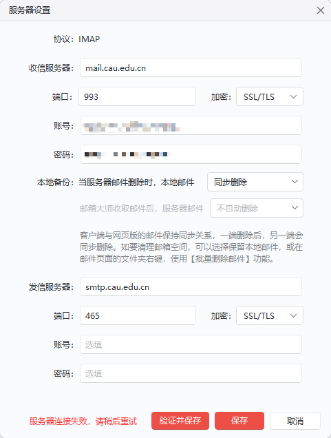

---
html:
    toc: true
    # number_sections: true # 标题开头加上编号
    toc_depth: 6
    toc_float:
        collapsed: false # 控制文档第一次打开时目录是否被折叠
        smooth_scroll: true # 控制页面滚动时，标题是否会随之变化
---

问题描述：

【验证并保存】长时间没反应，最后提示“服务器连接失败，请稍后重试”。

解决办法：

- 在确保协议、收信服务器、发信服务器、账号、密码（或授权码）正确的情况下，检查是否开启了VPN，关闭VPN后再次验证。